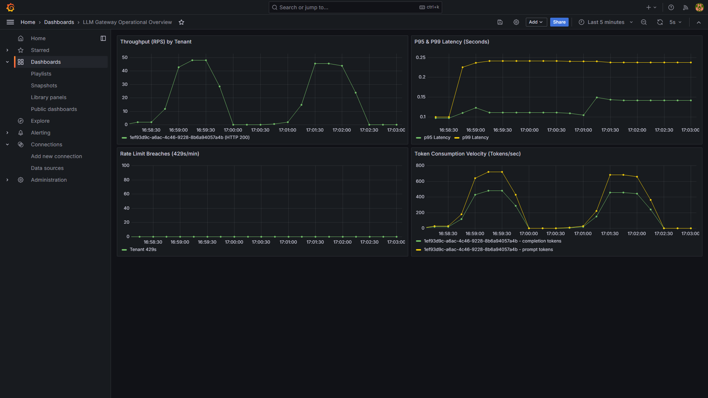

# Multi-Tenant LLM API Gateway


A high-performance, observable API gateway built with FastAPI (async), PostgreSQL, and Redis that proxies, rate limits, and observes traffic to LLM backends (Ollama / OpenAI).

Engineered with systems-first principles: features atomic sliding-window rate limiting via Redis Lua, read-through authentication caching, native Server-Sent Events (SSE) streaming, deferred asynchronous usage logging, and Prometheus/Grafana observability.

---

## Architecture Overview

```text
[ Client / k6 Load Generator ]  
       │  
       │ Bearer Token | HTTP POST /v1/chat/completions (stream: true|false)  
       ▼  
┌──────────────────────────────────────────────────────────┐  
│                      FastAPI Gateway                     │  
└──────────────┬────────────────────────────┬──────────────┘  
               │                            │  
  1. Auth Check│ (Read-Through Cache)       │ 2. Rate Limiting (Atomic Lua)  
               ▼                            ▼  
    ┌─────────────────┐          ┌─────────────────┐  
    │      Redis      │          │   Redis (ZSET)  │  
    │  cache:auth:*   │          │  rate_limit:*   │  
    └────────┬────────┘          └────────┬────────┘  
             │ Miss                       │ Allowed: Inject headers  
             ▼                            │ Exceeded: 429 Too Many Requests  
    ┌─────────────────┐                   ▼  
    │   PostgreSQL    │          ┌───────────────────────────────────┐  
    │   (api_keys)    │          │ Upstream Client (Ollama / Mock)   │  
    └─────────────────┘          │ • Buffered JSON OR                │  
                                 │ • SSE Real-Time Stream            │  
                                 └────────────────┬──────────────────┘  
                                                  │  
                                                  ▼  
                                 ┌───────────────────────────────────┐  
                                 │      FastAPI BackgroundTasks      │  
                                 └────────────────┬──────────────────┘  
                                                  │ Deferred async write  
                                                  ▼  
                                 ┌───────────────────────────────────┐  
                                 │            PostgreSQL             │  
                                 │ • request_logs                    │  
                                 │ • daily_usage                     │  
                                 └───────────────────────────────────┘  

[ Scrape /metrics (5s) ] ──► [ Prometheus:9090 ] ──► [ Grafana:3000 ]

```

### Real-Time Observability Dashboard


---

## Key Engineering Features

* **Multi-Tenant Auth with Read-Through Caching:** API keys are hashed with SHA-256 (raw keys are never stored in plaintext). Validated tenant contexts are cached in Redis with a 300s TTL, keeping repeat key lookups out of PostgreSQL.
* **Atomic Sliding-Window Rate Limiter:** Built using Redis Sorted Sets (`ZSET`) and evaluated via a single Lua script (`EVAL`) to prevent check-then-act race conditions across concurrent worker threads. Injects standard `X-RateLimit-Limit`, `X-RateLimit-Remaining`, and `Retry-After` headers.
* **Dual Execution Engine (Buffered & SSE Streaming):** Supports standard OpenAI-compatible requests (`POST /v1/chat/completions`) with real-time token streaming via Server-Sent Events (`text/event-stream`), recording Time-To-First-Token (TTFT).
* **Deferred Asynchronous Persistence:** Request latency, prompt/completion tokens, and daily aggregates are offloaded to PostgreSQL using FastAPI `BackgroundTasks`, keeping analytics writes off the critical request-response latency path.
* **Metrics Telemetry Stack:** Custom Prometheus metrics (`llm_gateway_requests_total`, `llm_gateway_tokens_total`, `llm_gateway_request_duration_seconds`) scraped every 5s and visualized in real-time Grafana dashboards.

---

## Sliding-Window Rate Limiting Algorithm (Lua)

To ensure sub-millisecond precision without distributed race conditions, rate limiting runs atomically inside Redis memory:

1. **Eviction:** `ZREMRANGEBYSCORE key -inf (now - window)` prunes timestamps older than 60s.
2. **Cardinality Check:** `ZCARD key` calculates current requests in the sliding window.
3. **Threshold Evaluation:** If `current_count < limit`:
* `ZADD key now (now:uuid)` appends the request.
* `EXPIRE key window` refreshes key TTL to prevent orphaned memory.
* Returns `{1, remaining_quota}` → Gateway adds rate-limit headers.


4. **Rejection:** If `current_count >= limit`:
* `EXPIRE key window` refreshes TTL.
* Returns `{0, 0}` → Gateway raises `HTTP 429 Too Many Requests`.


---

## Performance & Load Test Benchmarks

Benchmarks executed using **k6** against a simulated 50ms deterministic mock upstream to isolate gateway runtime overhead from local GPU inference speeds.

### Test Environment

* **OS / Host:** Windows 11 (AMD64)
* **Gateway Runtime:** Python 3.12, Uvicorn (1 worker process, `--log-level warning`)
* **Containers:** Docker Compose (PostgreSQL 16, Redis 7, Prometheus v2.x, Grafana 10.4)
* **k6 Scenario:** 25 Virtual Users (VUs) ramping over 30s, non-streaming buffered JSON requests

### Benchmark Results

| Metric | Baseline (DB Auth Query per Request) | Optimized (Redis Read-Through Auth Cache) | Delta |
| --- | --- | --- | --- |
| **Throughput** | 11.7 req/s | **70.0 req/s** | **+498% (6x)** |
| **Median Latency (`med`)** | 2,280 ms | **129 ms** | **-94% (17x faster)** |
| **P90 Latency** | 5,990 ms | **248 ms** | **-95%** |
| **P95 Latency** | 7,030 ms | **302 ms** | **-95%** |
| **Error Rate** | 0.84% (TCP resets) | **0.00% (0 errors / 2,106 reqs)** | **Zero Drops** |

> **Key Architectural Takeaway:** Moving tenant validation from an inline database query to a read-through Redis cache dropped connection checkout contention by 50% and eliminated lock contention on daily rollup rows during high-concurrency bursts.

---

## Architectural Decision Records & Trade-Offs

### 1. Read-Through Auth Cache vs. Immediate Key Revocation

* **Design:** Authenticated tenant records are cached in Redis for 300 seconds (`cache:auth:<hash>`).
* **Trade-off:** In exchange for sub-millisecond auth checks, revoking an API key in PostgreSQL does not immediately block an active client until the 300s TTL expires.
* **Production Mitigation:** In a production setting, a key revocation event would publish a cache invalidation signal (`DEL cache:auth:<hash>`) via Redis Pub/Sub.

### 2. FastAPI BackgroundTasks vs. Durable Message Queues

* **Design:** Usage logs and daily rollups are queued via FastAPI `BackgroundTasks` after the response is sent.
* **Trade-off:** Background tasks run within the same application process memory. If the Uvicorn process crashes or is killed before tasks complete, in-flight analytics events are lost.
* **Production Mitigation:** For guaranteed delivery, events would be pushed to an external durable queue (Redis Stream or Apache Kafka) consumed by dedicated worker services.

### 3. Metric Cardinality: Tenant Labels in Prometheus

* **Design:** `tenant_id` is included as a label on `llm_gateway_requests_total` for demonstration in Grafana.
* **Trade-off:** In multi-tenant environments with thousands of tenants, exposing `tenant_id` in Prometheus labels causes high cardinality and memory bloat.
* **Production Mitigation:** Keep Prometheus metrics bounded (e.g., `model`, `status_code`) and correlate tenant-level dimensions via distributed tracing (OpenTelemetry) or structured log aggregation (Loki/Elasticsearch).

---

## Tech Stack

* **Application:** Python 3.12, FastAPI (async), Uvicorn, Pydantic Settings
* **Package Management:** `uv`
* **Database & Migrations:** PostgreSQL 16, SQLAlchemy 2.0 (asyncpg), Alembic
* **Caching & Rate Limiting:** Redis 7 (`redis-py` async + Lua scripting)
* **Observability:** Prometheus, Grafana, `prometheus_client`
* **Benchmarking:** k6

---

## Testing

The project uses `pytest` with `httpx.AsyncClient` for async HTTP assertions and `fakeredis` for isolated, fast in-memory Redis unit testing without requiring active Docker containers.

```powershell
# Run unit and endpoint tests
uv run pytest
```

## Continuous Integration (CI)

This repository uses **GitHub Actions** (`.github/workflows/ci.yml`) for automated continuous integration:
* Spins up ephemeral **PostgreSQL 16** and **Redis 7** service containers in GitHub Actions runners.
* Restores dependency caches using `astral-sh/setup-uv`.
* Executes database migrations (`alembic upgrade head`).
* Runs the full `pytest` suite against real service containers with `MOCK_UPSTREAM=true`.

## Quickstart (Local Run)

### 1. Prerequisites

* [uv](https://docs.astral.sh/uv/)
* [Docker Desktop](https://www.docker.com/)
* (Optional) [Ollama](https://ollama.com/) with `qwen2.5-coder:1.5b` installed

### 2. Setup & Boot

```powershell
# Clone and enter repo
cd llm-gateway

# Set up environment variables
copy .env.example .env

# Start Postgres, Redis, Prometheus, and Grafana
docker compose up -d

# Sync dependencies and run DB migrations
uv sync --group dev
uv run alembic upgrade head

# Seed test tenant and generate an API key
uv run python -m scripts.seed
# (Save the printed sk_live_... key!)

# Start the gateway
uv run uvicorn app.main:app --reload

```

* **Interactive API Docs (Swagger UI):** [http://localhost:8000/docs](http://localhost:8000/docs)
* **Prometheus UI:** [http://localhost:9090](http://localhost:9090)
* **Grafana Dashboard:** [http://localhost:3000](http://localhost:3000) (admin/admin)

---

## API Usage Examples

### 1. Buffered Request

```powershell
$headers = @{
    "Authorization" = "Bearer sk_live_YOUR_KEY"
    "Content-Type" = "application/json"
}
$body = '{"model":"qwen2.5-coder:1.5b","messages":[{"role":"user","content":"ping"}]}'

Invoke-RestMethod -Uri "http://localhost:8000/v1/chat/completions" -Method Post -Headers $headers -Body $body

```

### 2. Real-Time Streaming (SSE)

```powershell
curl.exe -N -X POST "http://localhost:8000/v1/chat/completions" `
  -H "Authorization: Bearer sk_live_YOUR_KEY" `
  -H "Content-Type: application/json" `
  -d '{"model":"qwen2.5-coder:1.5b","messages":[{"role":"user","content":"Count 1 to 5"}],"stream":true}'

```

---

## Running Benchmarks

```powershell
# Set MOCK_UPSTREAM=true in .env to isolate gateway performance from local GPU speed
k6 run tests/load/benchmark.js

```